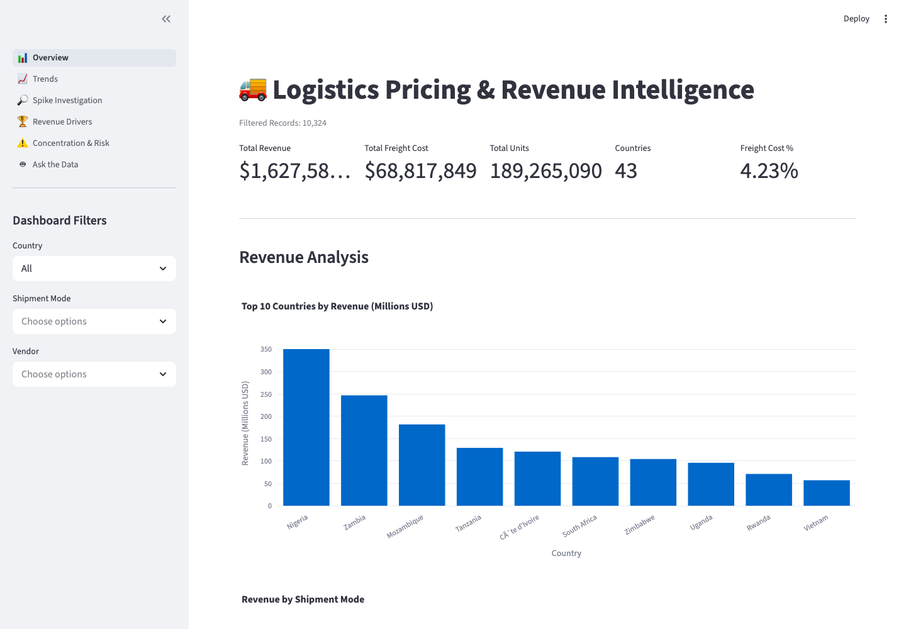
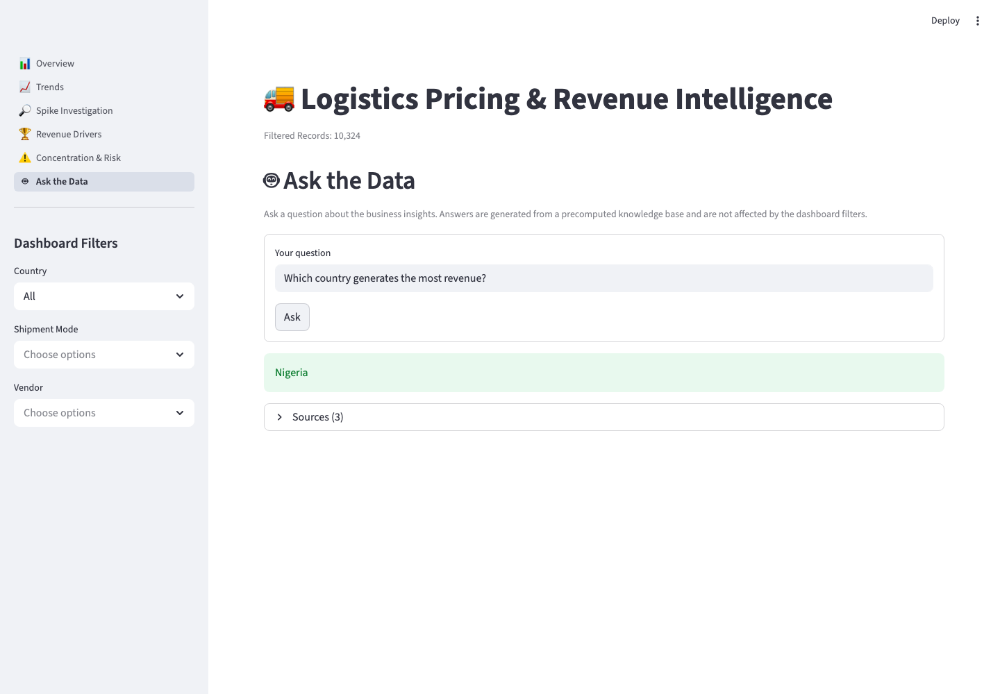

# 🚚 AI-Powered Logistics Pricing & Revenue Intelligence Platform

An end-to-end, real-world logistics analytics platform for shipment pricing,
revenue forecasting, explainable AI, and RAG-powered natural-language business
intelligence.

## Project Summary

> Built an end-to-end Logistics Revenue Intelligence Platform analyzing $1.6B+
> in shipment revenue across 43 countries using Python, Streamlit, forecasting
> models, and RAG-based natural-language analytics powered by ChromaDB and
> sentence-transformer embeddings.

## Business Problem

Logistics revenue in this dataset is heavily concentrated: a single vendor
drives ~67% of revenue, one product group ~87%, and the top 5 vendors ~88%.
That concentration is a dependency risk — losing one vendor, product line, or
country materially threatens the business. This platform surfaces those revenue
drivers and quantifies concentration/dependency risk across vendor, product, and
country dimensions, and lets analysts ask questions about the data in plain
English.

## Tech Stack

- Python
- Streamlit (multipage)
- XGBoost, SHAP, Plotly
- RAG: sentence-transformers + ChromaDB + FLAN-T5
- Docker (later)

## Architecture

```
                         data/supply_chain_data.csv (raw)
                                      |
                                +-----+------+
                                | Data Clean |  (utils/data_loader, scripts/data_cleaning)
                                +-----+------+
                                      |
                          +-----------+-----------+
                          |    Analytics Engine    |  (dashboard/ - KPIs, drivers, spikes)
                          +-----------+-----------+
                                      |
                        +-------------+-------------+
                        | Streamlit multipage app   |  (app.py + pages/)
                        | Overview / Trends / Spikes |
                        | Drivers / Concentration    |
                        | Ask-the-Data               |
                        +-------------+-------------+
              RAG pipeline            |  Ask-the-Data page
   knowledge_base/business_insights.txt
                  | load_knowledge_base.py
                  v
          sentence-transformers (all-MiniLM-L6-v2)
                  | embeddings
                  v
              ChromaDB  --retrieve-->  FLAN-T5 generator  -->  Answer
```

## Data Pipeline

1. **Raw data** — `data/supply_chain_data.csv` (shipment-level records).
2. **Cleaning** — `utils/data_loader.py` normalizes columns;
   `scripts/data_cleaning.py` handles missing values / labels.
3. **Aggregation** — `scripts/build_monthly_dataset.py` builds the monthly
   revenue series (`data/monthly_revenue.csv`) used by trends/forecasting.
4. **Analytics inputs** — the cleaned frame feeds the `dashboard/` modules.

## Analytics Features

The dashboard is a multipage Streamlit app:

- **📊 Overview** — headline KPIs (revenue, freight cost, units, countries,
  freight %), revenue by country and shipment mode.
- **📈 Trends** — monthly revenue and freight-cost trends.
- **🔎 Spike Investigation** — drill into the major revenue spike months
  (2011-09, 2014-06, 2015-03) by country, vendor, and shipment mode.
- **🏆 Revenue Drivers** — top driver per dimension, product-group revenue,
  vendor Pareto, country revenue share.
- **⚠️ Concentration & Risk** — concentration metrics, a custom dependency
  score, a scorecard, and risk classification.
- **🤖 Ask the Data** — natural-language Q&A over the business insights (RAG).

Sidebar filters apply across all pages.

## Forecasting Module

`forecasting/` contains an **experimental** revenue-forecasting prototype: an
XGBoost feature-engineering pipeline (time, lag, and rolling features) over the
monthly revenue series, currently evaluated against a naive lag-1 baseline. It
is a research prototype and is **not yet wired into the app**. See
"Future Enhancements".

## RAG Module

The "Ask the Data" feature is a local Retrieval-Augmented Generation pipeline:

1. `knowledge_base/business_insights.txt` — curated business facts.
2. `scripts/load_knowledge_base.py` — chunks + embeds the facts into ChromaDB.
3. `rag/embedding_model.py` — sentence-transformers (`all-MiniLM-L6-v2`).
4. `rag/vector_store.py` — persistent ChromaDB collection (cosine).
5. `rag/generator.py` — FLAN-T5 (`google/flan-t5-base`) answer generation.
6. `rag/pipeline.py` — retrieve → generate orchestration (`answer_question`).

Everything runs locally; no external API keys are required.

## Running the App

All dependencies are pinned in `requirements.txt` and installed into the
project's virtual environment (`venv/`). Always launch from that venv so the
RAG dependencies (sentence-transformers, chromadb, transformers) are available
— a globally-installed `streamlit` will fail with `ModuleNotFoundError`.

```bash
# 1. Build the RAG vector index (one-time, and after editing the knowledge base)
./venv/bin/python -m scripts.load_knowledge_base

# 2. Launch the Streamlit app
./venv/bin/python -m streamlit run app.py
```

The "🤖 Ask the Data" page answers natural-language questions about the
business insights using the local RAG pipeline.

## Deployment

### Hugging Face Spaces (recommended for the full RAG experience)

HF Spaces' free tier (16 GB RAM) comfortably runs the FLAN-T5 model. Create a
**Streamlit** Space, push this repo, and prepend this YAML frontmatter to the
top of the README in the Space (HF reads it to configure the Space):

```yaml
---
title: Logistics Revenue Intelligence
emoji: 🚚
colorFrom: blue
colorTo: indigo
sdk: streamlit
sdk_version: 1.57.0
app_file: app.py
pinned: false
---
```

The "Ask the Data" page builds the ChromaDB index automatically on the first
question, so no vector store needs to be committed.

### Streamlit Community Cloud

Connect this GitHub repo at https://share.streamlit.io and set the entry point
to `app.py`. **Caveat:** the free tier (~1 GB RAM) may run out of memory when
FLAN-T5 loads on the first "Ask the Data" question — the dashboard pages work
fine, but for reliable RAG use Hugging Face Spaces.

## Screenshots

### Overview Dashboard


### Ask the Data (RAG)


## Future Enhancements

- Finish the forecasting module (real XGBoost predictions, evaluation, app
  integration).
- Improve RAG answer quality (larger model, more context, prompt tuning).
- Dockerize for reproducible deploys.
- CI for the AppTest smoke checks.

## Branching Workflow

A simple two-tier flow. `main` is always releasable; `develop` is the
integration branch where features come together.

```
feature/* ──PR──> develop ──PR──> main (release)
```

1. **Branch** every change off `develop`: `git checkout develop && git checkout -b feature/<name>`.
2. **Open a PR into `develop`** when the feature is ready (not into `main`).
3. **Release** by opening a PR from `develop` into `main`, then tag the
   release on `main`.

Keep `develop` in sync after any release so it never falls behind `main`.
